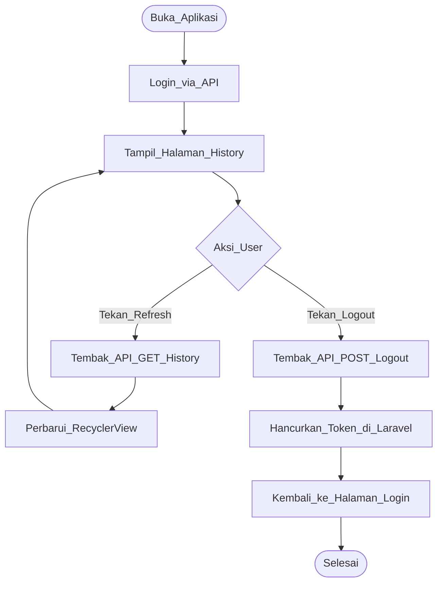

# 📱 Dokumentasi Project (Mobile Version)

## GenZehat - Calisthenics Workout Tracker (Android App)


---

## 📖 Deskripsi
**GenZehat (Mobile Edition)** adalah pendamping portabel untuk platform GenZehat Web. Aplikasi Android ini dirancang khusus agar pengguna dapat memantau riwayat latihan *Calisthenics* mereka langsung dari genggaman tangan.

Aplikasi ini terhubung langsung secara sinkron dengan *database* terpusat melalui integrasi **REST API** (didukung oleh Laravel Sanctum dari sisi *backend*).

### Fitur Utama:
- Menghadirkan antarmuka pengguna (UI) seluler yang responsif dan mudah dinavigasi.
- **Real-time Sync (Refresh):** Pengguna dapat memperbarui data riwayat latihan dari *server* tanpa perlu merestart aplikasi.
- **Secure Authentication:** Dilengkapi dengan sistem *login* dan *logout* yang aman, termasuk fitur *Auto-Clean* untuk mencegah penumpukan token API di server.
- Menampilkan riwayat latihan (Personal History) dengan *layout* khusus layar *mobile*.

### Tech Stack (Mobile):
- **IDE:** Android Studio
- **UI/UX:** XML Layouts & Material Design
- **Network/API:** Retrofit (Penghubung ke API Laravel)
- **Data Transfer:** JSON Serialization (Gson)

---

## 📋 User Story (Mobile Focus)

| ID | User Story | Priority |
|----|------------|----------|
| US-01 | Sebagai user, saya ingin login menggunakan akun yang sama dengan di Web | High |
| US-02 | Sebagai user, saya ingin menyegarkan (refresh) halaman agar bisa melihat jadwal terbaru tanpa harus keluar aplikasi | Medium |
| US-03 | Sebagai user, saya ingin melihat riwayat (*History*) mingguan dengan tampilan *mobile* | High |
| US-04 | Sebagai user, saya ingin bisa logout dengan aman agar akun saya tidak disalahgunakan | High |

---

## 📝 SRS - Feature List

### Functional Requirements
| ID | Feature | Deskripsi | Status |
|----|---------|-----------|--------|
| FR-01 | API Authentication | Login via endpoint API. Termasuk fitur *Auto-Clean* token lama di server saat berhasil login. | ✅ Done |
| FR-02 | Data Refresh | Tombol interaktif untuk memanggil ulang API GET History tanpa merestart aplikasi. | ✅ Done |
| FR-03 | Mobile History View | *RecyclerView* untuk menampilkan riwayat personal secara dinamis dari database. | ✅ Done |
| FR-04 | Secure Logout | Menghancurkan token Sanctum secara permanen di database dan melempar user ke halaman Login. | ✅ Done |

### Non-Functional Requirements
| ID | Requirement | Deskripsi |
|----|-------------|-----------|
| NFR-01 | UI Responsiveness | *Layout* menyesuaikan ukuran layar (dikunci pada posisi *Portrait*). |
| NFR-02 | Network Handling | Komunikasi jaringan berjalan lancar via IP lokal (LAN/WLAN) untuk pengujian. |

---

## 📊 UML Diagrams (Mobile Architecture)

### 1. Activity Diagram - Alur Refresh & Logout


---

## 🎨 Mock-Up / Screenshots (Android UI)

<div align="center">

### Tampilan Login

<br><br>

### Dashboard & Fitur Refresh

<br><br>

</div>

---

## 🚀 Panduan Build & Instalasi (Local Network)

Dikarenakan proses pengujian menggunakan **Emulator Eksternal** (bukan AVD bawaan Android Studio), arsitektur *network* yang digunakan berbasis IP Lokal (LAN/WLAN). Ikuti panduan berikut agar aplikasi bisa terhubung ke server Laravel:

### Langkah 1: Jalankan Web Server Laravel (Akses Eksternal)
Agar server web bisa diakses oleh emulator dari luar `localhost`, buka terminal pada folder **GenZehat Web** Anda dan jalankan perintah berikut:
```bash
php artisan serve --host=0.0.0.0 --port=8000
```

### Langkah 2: Cek IP Address (IPv4) Laptop Anda
1. Buka CMD (Command Prompt) di Windows.
2. Ketik perintah `ipconfig` dan tekan Enter.
3. Cari baris **IPv4 Address** (Contoh: `192.168.1.x`).
4. Catat IP tersebut.

### Langkah 3: Konfigurasi Base URL di Android
1. Buka file *source code* (misal `ApiClient.java`).
2. Ganti *Base URL* tersebut menggunakan IPv4 yang sudah dicatat tadi.
3. **Format yang benar:** `http://[IP_Laptop_Anda]:8000/api/` (Contoh: `http://192.168.1.5:8000/api/`).

### Langkah 4: Compile & Jalankan di Emulator Eksternal
1. Pastikan Emulator Eksternal Anda sudah berjalan.
2. Di Android Studio, pastikan nama emulator Anda sudah muncul di daftar perangkat terhubung (kiri atas tombol Play).
3. Klik ▶️ **Run 'app'** untuk menginstal aplikasi.

---
**Dibuat oleh:** Dava Anugrah Putra

