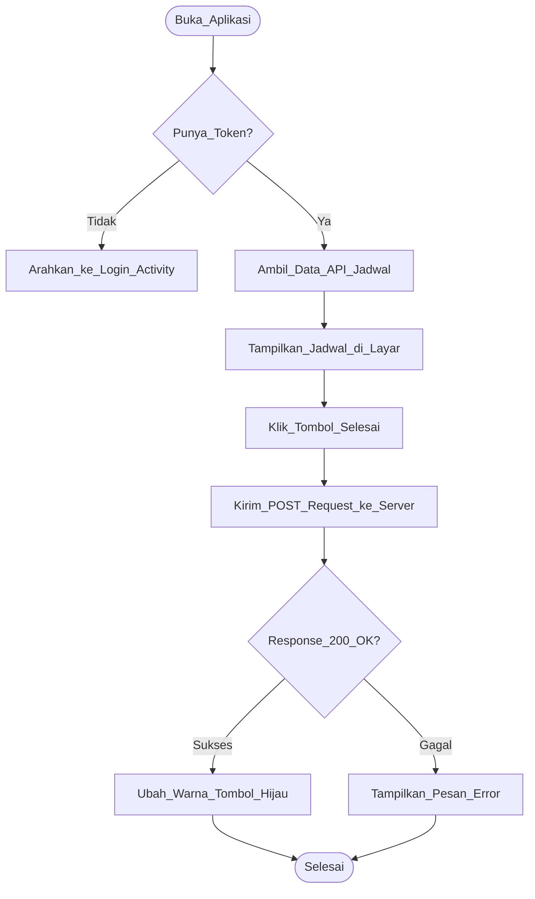
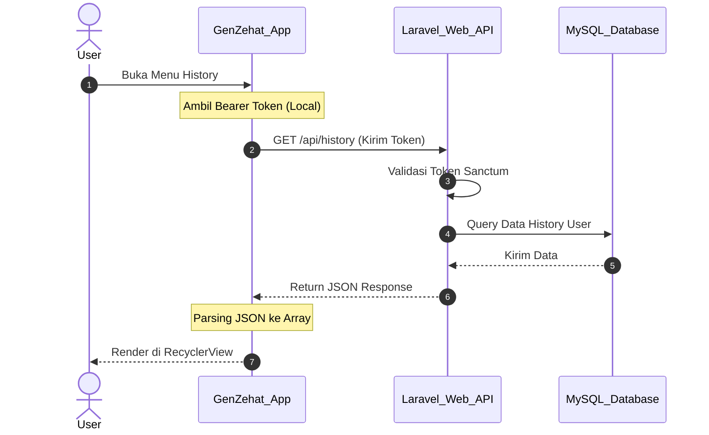

# 📱 Dokumentasi Project (Mobile Version)

## GenZehat - Calisthenics Workout Tracker (Android App)


---

## 📖 Deskripsi
**GenZehat (Mobile Edition)** adalah pendamping portabel untuk platform GenZehat Web. Aplikasi Android ini dirancang khusus agar pengguna dapat memantau riwayat latihan *Calisthenics* mereka langsung dari genggaman tangan, kapan pun dan di mana pun.

Aplikasi ini tidak berdiri sendiri, melainkan terhubung langsung secara sinkron dengan *database* terpusat melalui integrasi **REST API** (didukung oleh Laravel Sanctum dari sisi *backend*).

### Tujuan Utama:
- Menghadirkan antarmuka pengguna (UI) seluler yang responsif dan mudah dinavigasi.
- Memungkinkan pengguna melakukan *checklist* latihan harian langsung dari *smartphone* / *emulator*.
- Menampilkan riwayat latihan (Personal History) dengan *layout* khusus layar *mobile*.
- Memastikan data di aplikasi selalu sinkron *real-time* dengan data di Web.

### Tech Stack (Mobile):
- **IDE:** Android Studio
- **UI/UX:** XML Layouts & Material Design
- **Network/API:** Retrofit / Volley (Penghubung ke API Laravel)
- **Local Storage:** SharedPreferences (Untuk menyimpan Token Sesi/Login)

---

## 📋 User Story (Mobile Focus)

| ID | User Story | Priority |
|----|------------|----------|
| US-01 | Sebagai user, saya ingin login menggunakan akun yang sama dengan di Web | High |
| US-02 | Sebagai user, saya ingin melihat jadwal latihan hari ini saat membuka aplikasi | High |
| US-03 | Sebagai user, saya ingin mencentang status latihan di aplikasi dengan sekali *tap* | High |
| US-04 | Sebagai user, saya ingin melihat riwayat (*History*) mingguan dengan tampilan *mobile* | Medium |

---

## 📝 SRS - Feature List

### Functional Requirements
| ID | Feature | Deskripsi | Status |
|----|---------|-----------|--------|
| FR-01 | API Authentication | Login via endpoint API dan menyimpan *Bearer Token* secara lokal | ✅ Done |
| FR-02 | Mobile Daily Tracker | Tombol interaktif untuk *update* status latihan ke *server* | ✅ Done |
| FR-03 | Mobile History View | *RecyclerView* / *ListView* untuk menampilkan riwayat personal | ✅ Done |
| FR-04 | Logout System | Menghapus token dari aplikasi dan memutuskan sesi API | ✅ Done |

### Non-Functional Requirements
| ID | Requirement | Deskripsi |
|----|-------------|-----------|
| NFR-01 | UI Responsiveness | *Layout* menyesuaikan ukuran layar (dikunci pada posisi *Portrait*) |
| NFR-02 | Network Handling | Komunikasi jaringan berjalan lancar via IP lokal (LAN/WLAN) |
| NFR-03 | Security | Token API disimpan dengan aman menggunakan *SharedPreferences* |

---

## 📊 UML Diagrams (Mobile Architecture)

### 1. Activity Diagram - Interaksi API Latihan


### 2. Sequence Diagram - Komunikasi Mobile ke Web API


---

## 🎨 Mock-Up / Screenshots (Android UI)

<div align="center">

### Tampilan Login

<br><br>

### Dashboard & Tracker

<br><br>

### Personal History

<br><br>

</div>

---

## 🚀 Panduan Build & Instalasi (Local Network)

Dikarenakan proses pengujian menggunakan **Emulator Eksternal** (bukan AVD bawaan Android Studio), arsitektur *network* yang digunakan berbasis IP Lokal (LAN/WLAN). Ikuti panduan berikut agar aplikasi bisa terhubung ke server Laravel:

### Langkah 1: Jalankan Web Server Laravel (Akses Eksternal)
Agar server web bisa diakses oleh emulator dari luar `localhost`, buka terminal pada folder **GenZehat Web** Anda dan jalankan perintah berikut:
```bash
php artisan serve --host=0.0.0.0 --port=8000
```

### Langkah 2: Cek IP Address (IPv4) Laptop Anda
1. Buka CMD (Command Prompt) di Windows.
2. Ketik perintah `ipconfig` dan tekan Enter.
3. Cari baris **IPv4 Address** (Contoh: `192.168.1.x` atau `192.168.100.x`).
4. Catat IP tersebut.

### Langkah 3: Konfigurasi Base URL di Android
1. Buka *source code* Android Anda (misalnya di file `RetrofitClient`, `ApiConfig`, atau `Constants`).
2. Jangan gunakan `localhost` atau `10.0.2.2`. Ganti *Base URL* tersebut menggunakan IPv4 yang sudah dicatat tadi.
3. **Format yang benar:** `http://[IP_Laptop_Anda]:8000/api/` (Contoh: `http://192.168.1.5:8000/api/`).

### Langkah 4: Compile & Jalankan di Emulator Eksternal
1. Pastikan Emulator Eksternal Anda sudah berjalan.
2. Di Android Studio, pastikan nama emulator Anda sudah muncul di daftar perangkat terhubung (kiri atas tombol Play).
3. Klik ▶️ **Run 'app'** untuk menginstal aplikasi (APK) langsung ke dalam emulator tersebut.

*(Catatan: Pastikan firewall Windows Anda mengizinkan koneksi masuk pada port 8000 agar emulator tidak diblokir saat mengambil data API).*

---
**Dibuat oleh:** Dava Anugrah Putra

