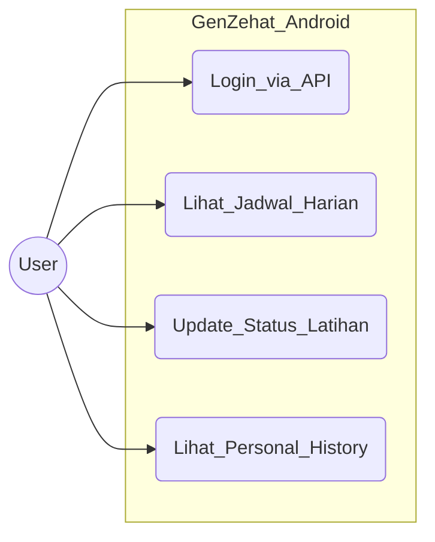
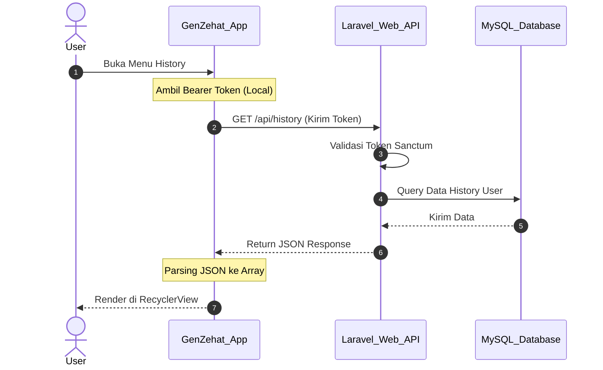

# 📱 Dokumentasi Project (Mobile Version)

## GenZehat - Calisthenics Workout Tracker (Android App)

---

## 📖 Deskripsi
**GenZehat (Mobile Edition)** adalah pendamping portabel untuk platform GenZehat Web. Aplikasi Android ini dirancang khusus agar pengguna dapat memantau jadwal dan riwayat latihan *Calisthenics* mereka langsung dari genggaman tangan, kapan pun dan di mana pun.

Aplikasi ini tidak berdiri sendiri, melainkan terhubung langsung secara sinkron dengan *database* terpusat melalui integrasi **REST API** (didukung oleh Laravel Sanctum dari sisi *backend*).

### Tujuan Utama:
- Menghadirkan antarmuka pengguna (UI) seluler yang responsif dan mudah dinavigasi.
- Memungkinkan pengguna melakukan *checklist* latihan harian langsung dari *smartphone*.
- Menampilkan riwayat latihan (Personal History) dengan *layout* khusus layar *mobile*.
- Memastikan data di HP selalu sinkron *real-time* dengan data di Web.

### Tech Stack (Mobile):
- **IDE:** Android Studio
- **UI/UX:** XML Layouts & Material Design
- **Network/API:** Retrofit / Volley / HttpURLConnection (Penghubung ke API Laravel)
- **Local Storage:** SharedPreferences (Untuk menyimpan Token Sesi/Login)

---

## 📋 User Story (Mobile Focus)

| ID | User Story | Priority |
|----|------------|----------|
| US-01 | Sebagai user, saya ingin login di HP menggunakan akun yang sama dengan di Web | High |
| US-02 | Sebagai user, saya ingin melihat jadwal latihan hari ini langsung saat membuka aplikasi | High |
| US-03 | Sebagai user, saya ingin mencentang status latihan di HP dengan sekali *tap* | High |
| US-04 | Sebagai user, saya ingin melihat riwayat (*History*) mingguan dengan tampilan yang nyaman di HP | Medium |

---

## 📝 SRS - Feature List

### Functional Requirements
| ID | Feature | Deskripsi | Status |
|----|---------|-----------|--------|
| FR-01 | API Authentication | Login via endpoint API dan menyimpan *Bearer Token* di perangkat | ✅ Done |
| FR-02 | Mobile Daily Tracker | Tombol interaktif untuk *update* status latihan ke *server* | ✅ Done |
| FR-03 | Mobile History View | *RecyclerView* / *ListView* untuk menampilkan riwayat personal | ✅ Done |
| FR-04 | Logout System | Menghapus token dari HP dan memutuskan sesi API | ✅ Done |

### Non-Functional Requirements
| ID | Requirement | Deskripsi |
|----|-------------|-----------|
| NFR-01 | UI Responsiveness | *Layout* menyesuaikan berbagai ukuran layar HP (hanya *Portrait*) |
| NFR-02 | Network Handling | Menampilkan pesan *error* jika HP tidak ada koneksi internet |
| NFR-03 | Security | Token API disimpan dengan aman di *SharedPreferences* |

---

## 📊 UML Diagrams (Mobile Architecture)

### 1. Use Case Diagram

### 2. Activity Diagram - Interaksi API Latihan

### 3. Sequence Diagram - Komunikasi Mobile ke Web API

---

## 🎨 Mock-Up / Screenshots (Android UI)

### Tampilan Login (Mobile)
*(Tambahkan gambar nanti)*
  

### Dashboard & Tracker (Mobile)
*(Tambahkan gambar nanti)*
  

### Personal History (Mobile)
*(Tambahkan gambar nanti)*
  

---

## 🚀 Panduan Build & Instalasi (Developer)

### Langkah 1: Persiapan Web Server Lokal
Karena Android ini mengambil data dari API, pastikan aplikasi web GenZehat berjalan terlebih dahulu di laptop (misal: `http://127.0.0.1:8000`).

### Langkah 2: Buka Proyek di Android Studio
1. Buka Android Studio.
2. Klik **Open**, lalu pilih folder `genzehat-android`.
3. Tunggu hingga proses **Gradle Sync** selesai 100%.

### Langkah 3: Konfigurasi Base URL API
Jika menjalankan aplikasi di **Emulator Android**, ubah URL API di dalam *source code* (misalnya di file `RetrofitClient.java` atau *Class Config*) dari `localhost` menjadi IP khusus Emulator:
- Ganti `http://127.0.0.1:8000` menjadi **`http://10.0.2.2:8000`**

*(Catatan: Jika menguji menggunakan HP asli yang dicolok kabel USB, gunakan IP Address WiFi laptop Anda, misal: `http://192.168.1.5:8000`)*

### Langkah 4: Jalankan Aplikasi (Run)
Klik tombol ▶️ **Run 'app'** di Android Studio untuk memasang aplikasi ke Emulator atau *Smartphone* fisik.

---
**Dibuat oleh:** Dava Anugrah Putra

