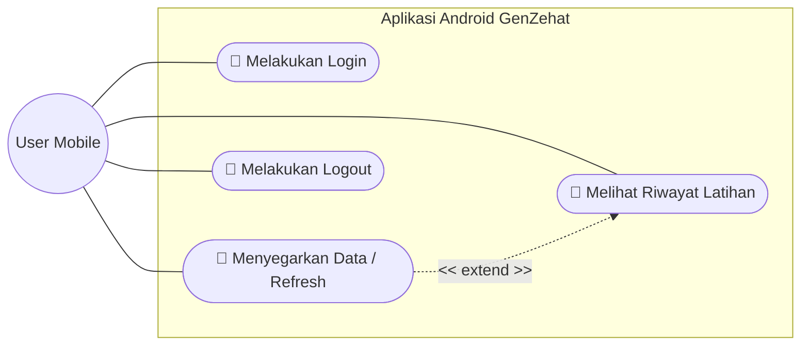
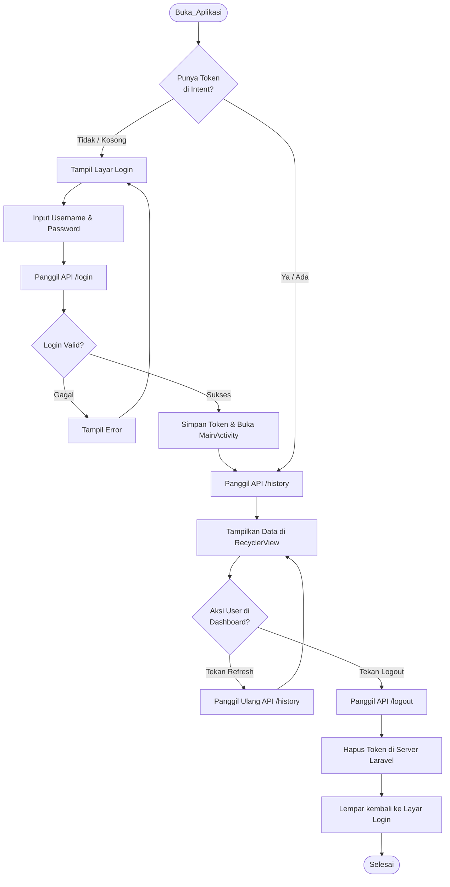
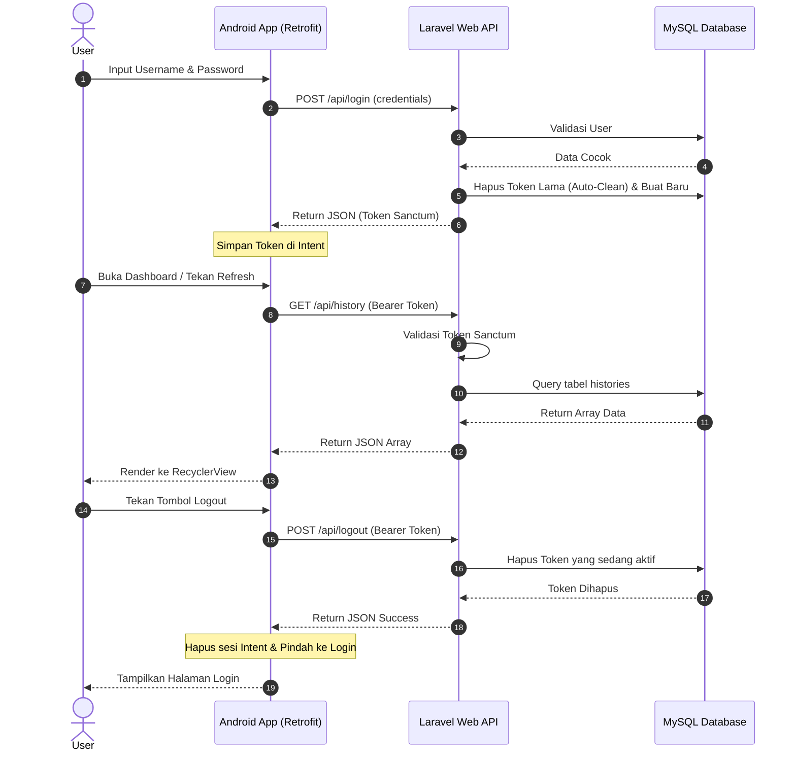

# 📱 Dokumentasi Project (Mobile Version)

## GenZehat - Calisthenics Workout Tracker (Android App)


---

## 📖 Deskripsi
**GenZehat (Mobile Edition)** adalah pendamping portabel untuk platform GenZehat Web. Aplikasi Android ini dirancang khusus agar pengguna dapat memantau riwayat latihan *Calisthenics* mereka langsung dari genggaman tangan.

Aplikasi ini terhubung langsung secara sinkron dengan *database* terpusat melalui integrasi **REST API** (didukung oleh Laravel Sanctum dari sisi *backend*).

### Fitur Utama:
- Menghadirkan antarmuka pengguna (UI) seluler yang responsif dan mudah dinavigasi.
- **Real-time Sync (Refresh):** Pengguna dapat memperbarui data riwayat latihan dari *server* tanpa perlu merestart aplikasi.
- **Secure Authentication:** Dilengkapi dengan sistem *login* dan *logout* yang aman, termasuk fitur *Auto-Clean* untuk mencegah penumpukan token API di server.
- Menampilkan riwayat latihan (Personal History) dengan *layout* khusus layar *mobile*.

### Tech Stack (Mobile):
- **IDE:** Android Studio
- **UI/UX:** XML Layouts & Material Design
- **Network/API:** Retrofit (Penghubung ke API Laravel)
- **Data Transfer:** JSON Serialization (Gson)

---

## 📋 User Story (Mobile Focus)

| ID | User Story | Priority |
|----|------------|----------|
| US-01 | Sebagai user, saya ingin login menggunakan akun yang sama dengan di Web | High |
| US-02 | Sebagai user, saya ingin menyegarkan (refresh) halaman agar bisa melihat jadwal terbaru tanpa harus keluar aplikasi | Medium |
| US-03 | Sebagai user, saya ingin melihat riwayat (*History*) mingguan dengan tampilan *mobile* | High |
| US-04 | Sebagai user, saya ingin bisa logout dengan aman agar akun saya tidak disalahgunakan | High |

---

## 📝 SRS - Feature List

### Functional Requirements
| ID | Feature | Deskripsi | Status |
|----|---------|-----------|--------|
| FR-01 | API Authentication | Login via endpoint API. Termasuk fitur *Auto-Clean* token lama di server saat berhasil login. | ✅ Done |
| FR-02 | Data Refresh | Tombol interaktif untuk memanggil ulang API GET History tanpa merestart aplikasi. | ✅ Done |
| FR-03 | Mobile History View | *RecyclerView* untuk menampilkan riwayat personal secara dinamis dari database. | ✅ Done |
| FR-04 | Secure Logout | Menghancurkan token Sanctum secara permanen di database dan melempar user ke halaman Login. | ✅ Done |

### Non-Functional Requirements
| ID | Requirement | Deskripsi |
|----|-------------|-----------|
| NFR-01 | UI Responsiveness | *Layout* menyesuaikan ukuran layar (dikunci pada posisi *Portrait*). |
| NFR-02 | Network Handling | Komunikasi jaringan berjalan lancar via IP lokal (LAN/WLAN) untuk pengujian. |

---

## 📊 UML Diagrams (Mobile Architecture)

### 1. Use Case Diagram - Interaksi Pengguna & Sistem
Diagram ini memetakan batasan sistem (*System Boundary*) dan aksi apa saja yang bisa dilakukan oleh pengguna di dalam aplikasi Android GenZehat.



### 2. Activity Diagram - Alur Penggunaan Aplikasi (Mobile)
Diagram ini menggambarkan alur aktivitas pengguna dari pertama kali membuka aplikasi, melakukan pengecekan token, hingga melakukan *refresh* data atau *logout*.



### 3. Sequence Diagram - Komunikasi API Terpusat
Diagram ini memetakan bagaimana aplikasi Android berkomunikasi dua arah dengan server Laravel menggunakan metode *REST API* dan *Bearer Token*.



---

## 🎨 Mock-Up / Screenshots (Android UI)

<div align="center">

### Tampilan Login

<br><br>

### Dashboard Histori

<br><br>

</div>

---

## 🚀 Panduan Penggunaan & Instalasi

Ada dua cara untuk mencoba aplikasi GenZehat Mobile, yaitu cara instan menggunakan APK (untuk pengguna umum) atau cara kompilasi manual (untuk developer).

### 🟢 CARA 1: Jalur Instan (Menggunakan File APK)
Bagi Anda yang tidak memiliki Android Studio dan menggunakan Emulator Eksternal (seperti LDPlayer, Nox, Bluestacks) atau HP Android langsung, ikuti langkah ini:

**1. Jalankan Server Backend (Laravel)**
Buka folder proyek **GenZehat Web** di CMD/Terminal laptop Anda, lalu jalankan perintah ini agar server terbuka untuk jaringan luar:
```bash
php artisan serve --host=0.0.0.0 --port=8000
```

**2. Unduh dan Install Aplikasi**
- Cari dan unduh file **`GenZehat.apk`** yang ada di halaman utama repository ini (atau di menu *Releases*).
- **Di Emulator Eksternal (LDPlayer, dll):** Cukup seret (*drag and drop*) file APK tersebut dari komputer Anda ke dalam jendela emulator yang sedang menyala. Aplikasi akan terinstal otomatis.

> **⚠️ PERHATIAN PENTING:** > File APK yang tersedia mungkin telah dikonfigurasi (*hardcoded*) menggunakan IP Address lokal milik developer asli. Jika aplikasi gagal terhubung ke server/tidak bisa login, Anda **wajib** menggunakan CARA 2 di bawah ini untuk menyesuaikan IP dengan jaringan WiFi Anda sendiri.

---

### 🛠️ CARA 2: Jalur Developer (Kompilasi Manual via Android Studio)
Jika Anda ingin mengembangkan lebih lanjut atau perlu mengubah konfigurasi IP *server* lokal Anda sendiri:

**1. Cek IP Address (IPv4) Komputer Anda**
- Buka CMD (Command Prompt) di Windows.
- Ketik `ipconfig` dan cari baris **IPv4 Address** (Contoh: `192.168.1.5`).

**2. Ubah Base URL di Source Code**
- Buka proyek ini menggunakan **Android Studio**.
- Cari file konfigurasi API (misal: `ApiClient.java`).
- Ganti *Base URL* dengan IPv4 komputer Anda. Format yang benar: `http://[IP_Komputer_Anda]:8000/api/` (Contoh: `http://192.168.1.5:8000/api/`).

**3. Build & Run**
- Pastikan Emulator (atau HP fisik Anda) sudah terhubung dan terdeteksi di Android Studio.
- Klik tombol ▶️ **Run 'app'** (atau tekan `Shift + F10`) untuk mengompilasi kode dan menjalankan aplikasi secara langsung.

---
**Dibuat oleh:** Dava Anugrah Putra

