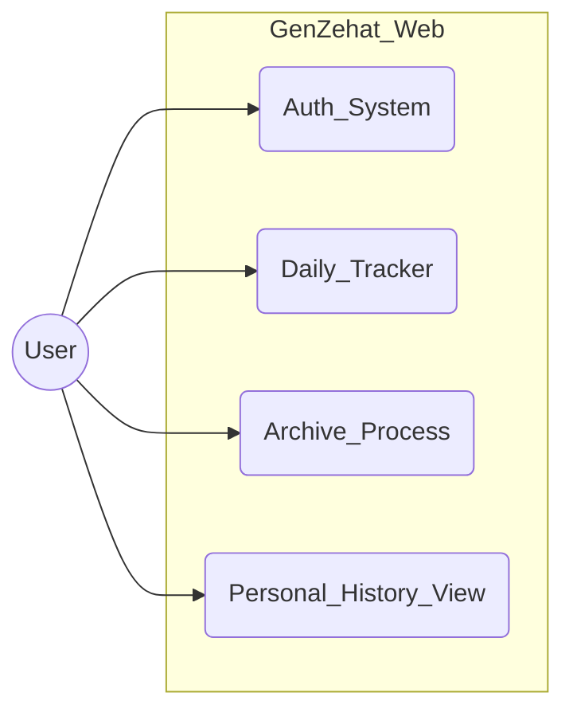
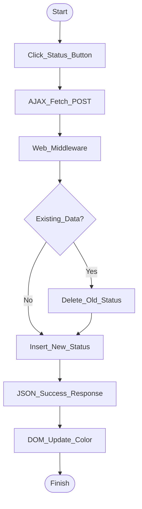
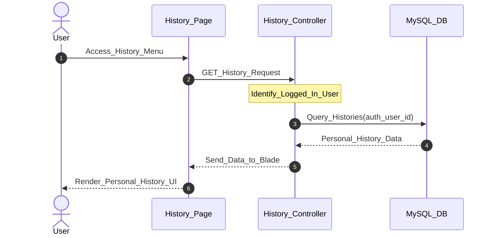
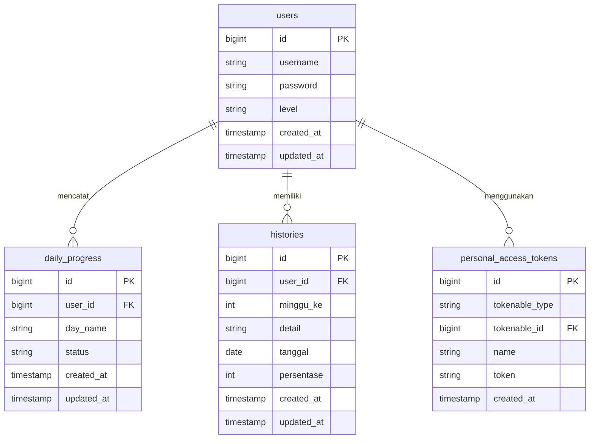

# 📚 Dokumentasi Project (Progress Report)

## GenZehat - Calisthenics Workout Tracker (Web Version)


---

## 📖 Deskripsi
GenZehat adalah platform pelacak kebugaran (Fitness Tracker) berbasis web yang dirancang untuk membantu pengguna memantau progres latihan *Calisthenics* (olahraga beban tubuh) secara terstruktur. Aplikasi ini fokus pada pengelolaan jadwal latihan pribadi dan pengarsipan progres mingguan untuk memantau konsistensi pengguna secara mandiri.

### Tujuan Utama:
- Menyediakan jadwal latihan beban tubuh (Bodyweight) yang terstruktur.
- Membantu pengguna memantau konsistensi melalui fitur pencatatan harian interaktif.
- Mendukung pemula hingga profesional dengan sistem Level Latihan.
- Menyediakan riwayat progres (Personal History) untuk evaluasi latihan mandiri.
- Menyediakan basis data terpusat yang terintegrasi dengan aplikasi Android via REST API.

### Tech Stack:
- **Backend:** Laravel 11
- **Frontend:** Blade Templates + Vanilla JavaScript (Fetch API)
- **Database:** MySQL 8.0
- **Authentication:** Laravel Session & CSRF Protection
- **Cross-Platform Support:** Laravel Sanctum (Mendukung endpoint API untuk Mobile)

---

## 📋 User Story

| ID | User Story | Priority |
|----|------------|----------|
| US-01 | Sebagai user, saya ingin membuat akun agar progres latihan tersimpan secara privat | High |
| US-02 | Sebagai user, saya ingin mencentang jadwal harian (Selesai/Terlewat) secara instan | High |
| US-03 | Sebagai user, saya ingin mengarsipkan progres minggu ini untuk melihat statistik keberhasilan | High |
| US-04 | Sebagai user, saya ingin mengganti tingkat kesulitan (Pemula/Menengah/Pro) | Medium |
| US-05 | Sebagai user, saya ingin melihat daftar riwayat (History) mingguan yang sudah saya selesaikan | Medium |

---

## 📝 SRS - Feature List

### Functional Requirements
| ID | Feature | Deskripsi | Status |
|----|---------|-----------|--------|
| FR-01 | Web Authentication | Login, Register, Logout menggunakan Laravel Session | ✅ Done |
| FR-02 | Daily Progress Tracker | Checklist harian interaktif via AJAX Fetch API | ✅ Done |
| FR-03 | Level Management | Pilihan level latihan (Pemula, Menengah, Pro) | ✅ Done |
| FR-04 | Workout Details | Modal popup berisi instruksi gerakan dan repetisi | ✅ Done |
| FR-05 | Personal Archiving | Fitur "Save & Exit" untuk mengarsipkan statistik mingguan | ✅ Done |
| FR-06 | History View | Halaman khusus untuk melihat riwayat progres pribadi | ✅ Done |

### Non-Functional Requirements
| ID | Requirement | Deskripsi |
|----|-------------|-----------|
| NFR-01 | Security | CSRF protection untuk semua request POST di Web |
| NFR-02 | Performance | Update UI instan (Asynchronous) tanpa reload halaman |
| NFR-03 | Data Integrity | Mencegah duplikasi data status harian di database |
| NFR-04 | Usability | Desain responsif untuk penggunaan di browser PC |

---

## 📊 UML Diagrams & ERD

### 1. Use Case Diagram


### 2. Activity Diagram - Update Status (AJAX)


### 3. Sequence Diagram - Personal History Retrieval


### 4. Entity Relationship Diagram (ERD)


---

## 🎨 Mock-Up / Screenshots
*(Letakkan file gambar Anda di folder docs/)*
1. **Dashboard & Jadwal:** ``
2. **Personal History:** ``

---

## 🔄 SDLC (Software Development Life Cycle)

**Metodologi:** Waterfall dengan iterasi

| Phase | Aktivitas | Output |
|-------|-----------|--------|
| **1. Planning** | Menentukan target latihan & alur aplikasi | Requirement Doc |
| **2. Analysis** | Merancang struktur database (Relasional) | SRS, Feature List |
| **3. Design** | Membuat UML diagram & ERD | UML, ERD, Mockups |
| **4. Development** | Coding Backend (Laravel) & Frontend (JS) | Source code Web |
| **5. Testing** | Uji tombol AJAX & perhitungan persentase | Test Result |
| **6. Deployment** | Setup server lokal & integrasi Mobile API | Live application |

---

## 🚀 Instalasi (Lokal)

### Langkah 1: Clone Repository
```bash
git clone [https://github.com/username-kamu/GenZehat.git](https://github.com/username-kamu/GenZehat.git)
cd GenZehat
```

### Langkah 2: Install Dependencies & Setup
```bash
composer install
cp .env.example .env
php artisan key:generate
```

### Langkah 3: Setup Database
**Edit file `.env`** sesuaikan DB_DATABASE, lalu jalankan:
```bash
php artisan migrate
```

### Langkah 4: Jalankan Server
```bash
php artisan serve
```
Aplikasi Web: **http://localhost:8000**

---

## 📁 Struktur Database
- **users**: Data akun pengguna (Username, Password, Level).
- **daily_progress**: Status latihan harian (Day_name, Status).
- **histories**: Arsip progres mingguan (User_id, Minggu_ke, Persentase).
- **personal_access_tokens**: Tabel bawaan Sanctum untuk mengelola token API.

---

## 🌐 Web Internal Endpoints (AJAX)
| Method | Endpoint | Deskripsi |
|--------|----------|-----------|
| POST | `/save-progress` | Menyimpan status harian secara real-time |
| POST | `/save-history` | Mengarsipkan data minggu ini ke tabel history |

---
**Dibuat oleh:** Dava Anugrah Putra
