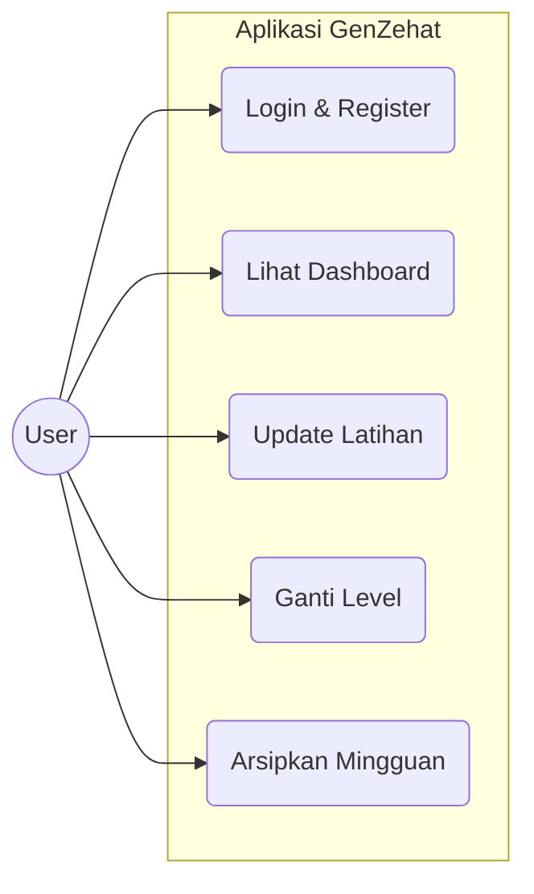
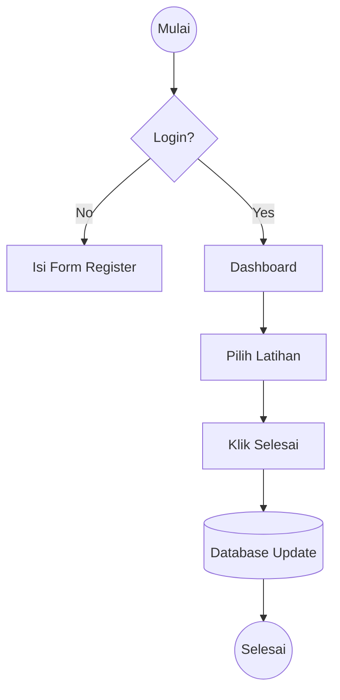
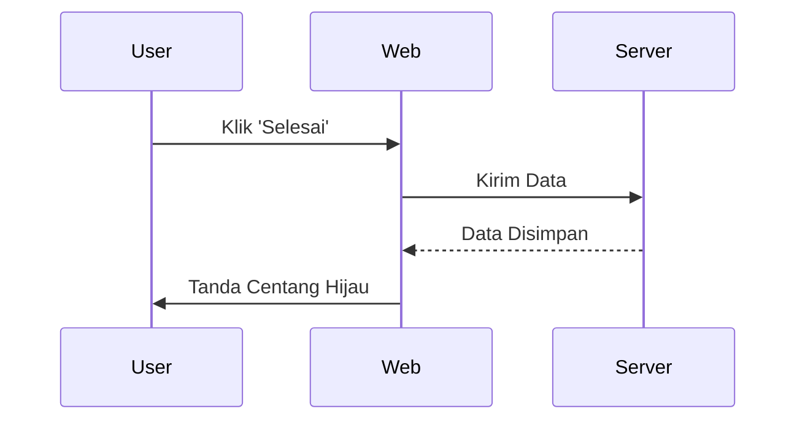

# Dokumentasi Project (Progress Report) - GenZehat
Nama: Dava Anugrah Putra | 
Kelas: II RKS A | 
NPM: 2423102012

## 1. Deskripsi
GenZehat adalah aplikasi web berupa penjadwalan aktivitas olahraga sederhana yang dirancang untuk membantu pengguna dalam meningkatkan kebugaran, khususnya pemula hingga profesional, dalam menjaga konsistensi olahraga. Aplikasi ini menyediakan jadwal latihan yang terstruktur, pelacakan progress olahraga, dan sistem level Pemula, Menengah,dan Profesional yang tiap levelnya akan menyesuaikan intensitas dari latihannya.

## 2. User Story
Sebagai user, saya ingin:
- Mendaftar dan Login untuk menyimpan data latihan saya secara pribadi.
- Memilih tingkat kesulitan latihan yang sesuai dengan kemampuan fisik saya.
- Menandai latihan harian sebagai "Selesai" atau "Terlewat".
- Melihat grafik statistik kemajuan saya dalam satu minggu.
- Menyimpan riwayat latihan mingguan saya ke dalam pelacakan aktivitas.

## 3. SRS (Software Requirements Specification)

### Feature List (Daftar Fitur)
1.  **Autentikasi Pengguna:**
    - Register akun baru.
    - Login session.
2.  **Manajemen Latihan:**
    - 3 Pilihan Level: Pemula, Menengah, Profesional.
    - Detail jenis-jenis latihan tiap harinya.
3.  **Tracking System:**
    - Checklist harian (Selesai/Terlewat/Reset).
    - Visualisasi Progress Bar.
    - Feedback motivasi otomatis berdasarkan performa.
4.  **Data Management:**
    - Penyimpanan progress menggunakan JSON di database MySQL.
    - Fitur "Archive Week" untuk mereset minggu dan menyimpan ke riwayat.
    - Fitur Reset Log aktivitas.

## 4. UML Diagram

### a. Use Case Diagram

```mermaid
graph LR
    %% Aktor (User) dilambangkan dengan lingkaran ganda
    User((User))

    %% Kotak Sistem Aplikasi
    subgraph Aplikasi [Aplikasi GenZehat]
        direction TB
        UC1(Login & Register)
        UC2(Lihat Dashboard)
        UC3(Update Latihan)
        UC4(Ganti Level)
        UC5(Arsipkan Mingguan)
    end

    %% Garis Hubung
    User --> UC1
    User --> UC2
    User --> UC3
    User --> UC4
    User --> UC5
```

### b. Activity Diagram

```mermaid
flowchart TD
    Start((Mulai)) --> Login{Login?}
    Login -- No --> Form[Isi Form Register]
    Login -- Yes --> Dash[Dashboard]
    Dash --> Pilih[Pilih Latihan]
    Pilih --> Klik[Klik Selesai]
    Klik --> DB[(Database Update)]
    DB --> End((Selesai))
```

### c. Sequence Diagram

```mermaid
sequenceDiagram
    participant User
    participant Web
    participant Server
    User->>Web: Klik 'Selesai'
    Web->>Server: Kirim Data
    Server-->>Web: Data Disimpan
    Web->>User: Tanda Centang Hijau
```

## 5. Mock-Up
Tampilan antarmuka (UI) pada aplikasi GenZehat
### a. Tampilan Login & Register

### b. Tampilan Dashboard

### c. Tampilan Menu Setting

### d. Tampilan Menu Setting

### e. Tampilan Pelacakan Aktivitas

